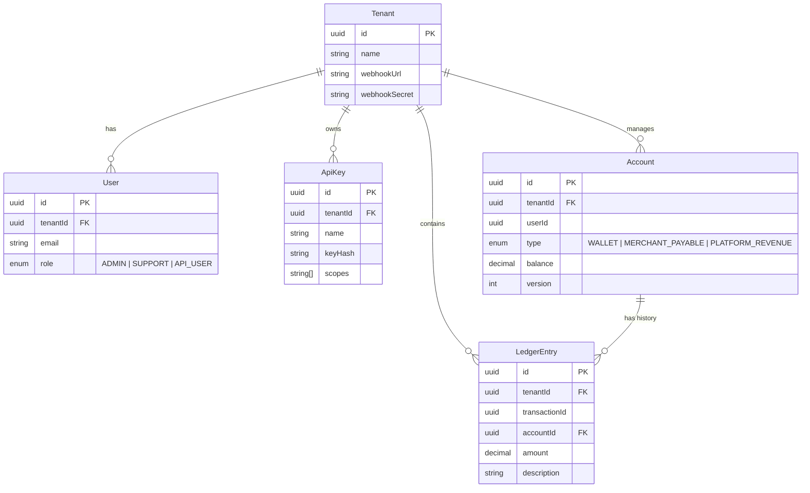

<p align="center">
  <h1 align="center">💸 Hwala </h1>
  <p align="center">
    <b>Enterprise-grade, Multi-Tenant Digital Wallet & Financial Ledger Engine</b>
  </p>
  <p align="center">
    Built with NestJS 11, Prisma 7, PostgreSQL, Redis, and BullMQ.
  </p>
</p>

---

## 📌 Overview

**Hwala Core** is a multi-tenant financial transaction engine and double-entry ledger platform designed for scale, fault tolerance, and absolute financial consistency. It handles account management, funds transfers with strict transactional locks, rate-limiting velocity checks, API key / JWT authentication, and asynchronous webhook dispatching via BullMQ worker queues.

---

## ⚡ Current Specifications & Technology Stack

| Layer | Technology / Tool | Description |
| :--- | :--- | :--- |
| **Framework** | **NestJS 11** | Progressive Node.js TypeScript framework with modular architecture |
| **Database** | **PostgreSQL** | Primary relational datastore for ledger integrity and accounts |
| **ORM** | **Prisma 7** (`@prisma/client` + `@prisma/adapter-pg`) | Type-safe database client using PostgreSQL native driver adapters |
| **Caching & Queues** | **Redis** + **BullMQ** (`@nestjs/bullmq`, `ioredis`) | Asynchronous background processing, rate limiting, and velocity limits |
| **Authentication** | **JWT & API Key** (`passport-jwt`, custom Guards) | Dual-mode auth with scoped permissions (`scopes`) and tenant isolation |
| **Security** | **Helmet**, **Class Validator**, **Rate Limiter** | Production security headers, DTO validation pipes, and Redis throttlers |
| **API Docs** | **Swagger / OpenAPI** (`@nestjs/swagger`) | Interactive REST API documentation at `/api/docs` |
| **Health Checks** | **NestJS Terminus** (`@nestjs/terminus`) | Health monitoring at `/health` for DB and Redis status |

---

## 🔑 Core Features & Architectural Highlights

* 🏢 **Multi-Tenancy Isolation (`Tenant`):**
  * Every account, ledger entry, and API key belongs to a specific `tenantId`.
  * Middleware and Guards enforce cross-tenant data isolation.

* ⚖️ **Double-Entry Ledger Engine:**
  * Transfers generate strictly balanced `LedgerEntry` pairs (Debit `-amount` and Credit `+amount`) referencing a single `transactionId`.
  * Optimistic versioning (`version` field) and explicit row-level database locking (`FOR UPDATE`) prevent race conditions and double-spending.

* 🔒 **Deadlock Prevention:**
  * Row-locking order is deterministically sorted by account UUID (`[senderId, receiverId].sort()`), eliminating database deadlocks during high-concurrency transfers.

* 🚀 **Velocity Limits & Redis Throttling:**
  * Dynamic velocity limits (e.g., max transfers per minute per account) enforced in Redis *before* acquiring heavy database transaction locks.

* 🔐 **Fine-Grained Scopes & Roles:**
  * Support for roles (`ADMIN`, `SUPPORT`, `API_USER`) and explicit permission scopes (e.g., `['read:ledgers', 'write:ledgers']`) via custom NestJS guards (`@Scopes()`, `@Roles()`).

* 📩 **Resilient Webhook Dispatcher:**
  * Background worker queue (`BullMQ`) dispatches event notifications (e.g., `transfer.completed`) to merchant `webhookUrl` endpoints with exponential backoff retries.

---

## 🗄️ Database Domain Model



---

## 🚀 Environment Variables (`.env`)

| Variable | Default Value | Description |
| :--- | :--- | :--- |
| `DATABASE_URL` | `postgresql://postgres@localhost:5432/hawala_db` | PostgreSQL connection string |
| `REDIS_HOST` | `localhost` | Redis server hostname |
| `REDIS_PORT` | `6379` | Redis server port |
| `REDIS_PASSWORD` | `""` | Redis authentication password (optional) |
| `JWT_SECRET` | *(required)* | 256-bit secret key for signing JWT tokens |
| `THROTTLE_TTL` | `60000` | Rate limit window in milliseconds (1 minute) |
| `THROTTLE_LIMIT` | `100` | Max allowed API calls per rate limit window |
| `PORT` | `3000` | HTTP application listening port |
| `CORS_ORIGIN` | `http://localhost:3000,http://localhost:5173` | Allowed CORS origins |

---

## 🌐 API Reference Overview

Interactive Swagger documentation is available at **`http://localhost:3000/api/docs`**.

### Key Routes

| Method | Endpoint | Auth Required | Description |
| :--- | :--- | :--- | :--- |
| **GET** | `/health` | None | System health check (DB & Redis status) |
| **POST** | `/auth/register` | Admin / Internal | Register a new user |
| **POST** | `/auth/login` | None | Authenticate user & retrieve JWT token |
| **POST** | `/accounts` | JWT / API Key | Create a new financial account (`WALLET`, etc.) |
| **GET** | `/accounts/:id` | JWT / API Key | Fetch account balance and metadata |
| **POST** | `/transfers` | JWT / API Key (`write:ledgers`) | Execute a funds transfer between accounts |
| **POST** | `/api-keys` | JWT (`ADMIN`) | Generate scoped API key for tenant integration |

---

## 🛠️ Local Development & Setup

### Prerequisites

- **Node.js**: `v20+`
- **Docker & Docker Compose** (for local PostgreSQL and Redis)

### Installation

```bash
# 1. Install project dependencies
npm install

# 2. Start PostgreSQL and Redis via Docker Compose
docker-compose up -d

# 3. Copy environment variables
cp .env.example .env

# 4. Run Prisma database migrations and client generation
npx prisma db push
npx prisma generate

# 5. Start the application in development mode
npm run start:dev
```

### Running Tests

```bash
# Unit tests
npm run test

# End-to-end tests
npm run test:e2e

# Test coverage
npm run test:cov
```

