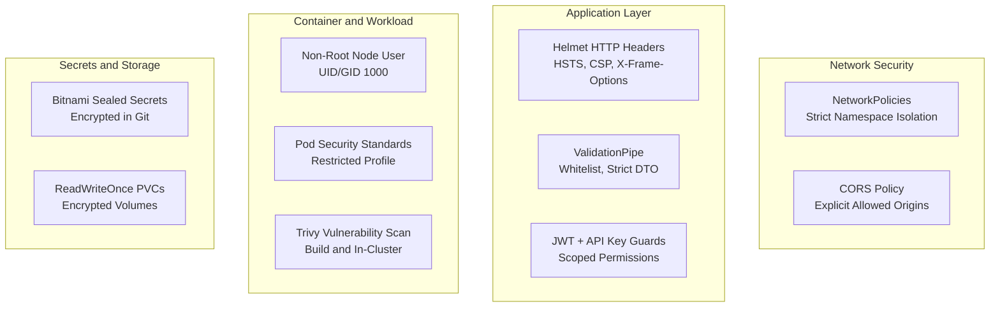

# Security Hardening and Container Policy

Security posture and defense-in-depth controls enforced across the Hwala Core financial platform ecosystem.

---

## Defense-in-Depth Security Matrix



---

## Security Controls Checklist

| Layer | Control | Enforced By | Status |
|:---|:---|:---|:---|
| **App** | Strict HTTP Security Headers (HSTS, CSP, X-Frame-Options, X-Content-Type-Options) | `helmet` in `src/main.ts` | Enforced |
| **App** | X-Powered-By Signature Removal | Express HttpAdapter | Enforced |
| **App** | Payload Whitelisting and Filtering | NestJS `ValidationPipe` | Enforced |
| **App** | Request Rate Limiting | `ThrottlerModule` + Redis | Enforced |
| **Container** | Multi-stage Distroless-style Build | `Dockerfile` | Enforced |
| **Container** | Non-Root User Execution (`USER node`) | `Dockerfile` / Pod Spec | Enforced |
| **K8s** | Pod Security Standards (`restricted`) | Namespace Label | Enforced |
| **K8s** | Network Isolation and Egress Filtering | `NetworkPolicy` | Enforced |
| **K8s** | Resource Limits and Quotas | `ResourceQuota` / `LimitRange` | Enforced |
| **CI/CD** | Static Application Security Testing (SAST) | GitHub Actions CodeQL | Enforced |
| **CI/CD** | Container Vulnerability Scanning | Trivy Action and Operator | Enforced |

---

## Installing In-Cluster Trivy Vulnerability Scanner

```bash
helm repo add aqua https://aquasecurity.github.io/helm-charts/
helm repo update

helm upgrade --install trivy-operator aqua/trivy-operator \
  --namespace trivy-system \
  --create-namespace \
  --values deploy/security/trivy-operator-values.yaml
```
